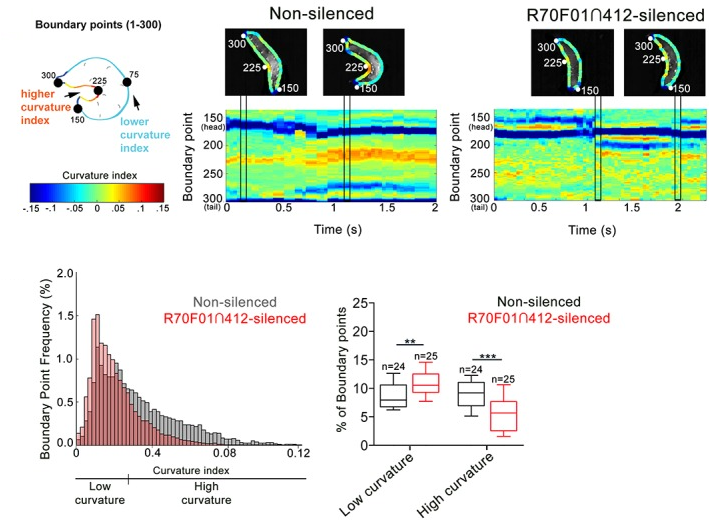

# Drosophila-larva-kymograph

These two MATLAB scripts takes videos of fruit fly larva as input and analyzes curvature (curvature.m) and creates kymographs for visualization (kymograph.m). A sample video file is included for testing the code. These scripts were used in our publication Burgos et al., 2018.

